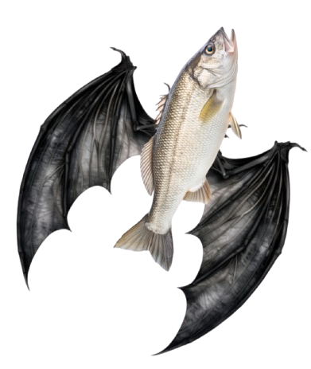

<div align="center">
  
</div>

# fish-bat

A ~~port of [fdellwing/zsh-bat](https://github.com/fdellwing/zsh-bat)~~ completely original bat plugin for the Fish shell.

### Installation

Install with [fisher](https://github.com/jorgebucaran/fisher):

```shell
fisher install givensuman/fish-bat
```

### Usage

Replaces `cat` with `bat`. To run the normal `cat` command, use `rcat`. Also enables syntax highlighting for the `man` command and any `--help` output!

### Requirements

Just requires [bat](https://github.com/sharkdp/bat)!

### License

[MIT](../LICENSE)
